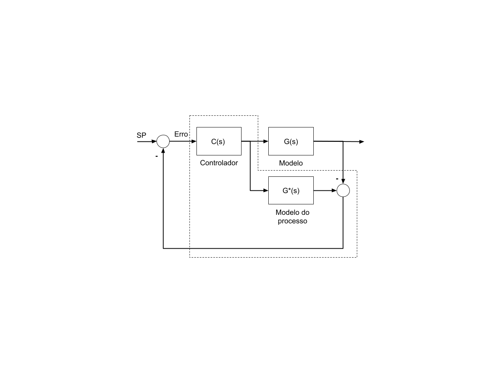

# Método de Controle com Modelo Interno (IMC)

Este documento descreve o método IMC utilizado na sintonização dos controladores.

## 📌 Figura do Modelo do Processo

## 📊 Tabela de Sintonização

| Modelo do Processo                  | Kp                      | Ki             | Kd               |
|------------------------------------|--------------------------|----------------|------------------|
| K / (τs + 1)                        | τ / (K * τc)            | τ              | -                |
| K / [(τ₁s + 1)(τ₂s + 1)]           | (τ₁ + τ₂) / (K * τc)     | τ₁ + τ₂        | (τ₁ * τ₂)/(τ₁+τ₂)|
| 1 / (s(τs + 1))                     | 1 / (K * τc)            | -              | τ                |
